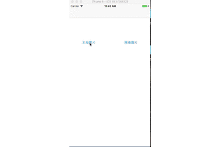

# XCPhotoBrowser

[](https://cocoapods.org/pods/XCPhotoBrowser)
[](https://cocoapods.org/pods/XCPhotoBrowser)
[](https://cocoapods.org/pods/XCPhotoBrowser)
[](https://www.apple.com/nl/ios/)&nbsp;

***
|Author|小小聪明屋|
|---|---|
|E-mail|1016697223@qq.com|
|GitHub|https://github.com/fanxiaocong|
|Blog|https://fanxiaocong.github.io|
***

## Example

图片预览功能，支持本地和网络图片的预览，使用方便。



### 预览本地图片

```objc
/**
 照片浏览器Image
 
 @param fromVC              源控制器（是从哪一个控制器跳转过来的）
 @param selectedIndex       选中的图片的下标
 @param selectedImageView   选中的图片
 @param images              图片数组
 @param configure           配置参数（传空为默认）
 */
+ (void)showFromViewController:(UIViewController *)fromVC
                 selectedIndex:(NSInteger)selectedIndex
              seletedImageView:(UIImageView *)selectedImageView
                        images:(NSArray<UIImage *> *)images
                     configure:(XCPhotoBrowserConfigure *)configure;
                     

/// 调用
[XCPhotoBrowserManager showFromViewController:self.navigationController
                                    selectedIndex:index
                                 seletedImageView:imgView
                                           images:self.imgsArr
                                        configure:config];
```

### 预览网络图片

```objc
/**
 照片浏览器URL

 @param fromVC              源控制器（是从哪一个控制器跳转过来的）
 @param selectedIndex       选中的图片的下标
 @param selectedImageView   选中的图片
 @param urls                图片的url字符串数组
 @param thumbImgs           缩略图片数组
 @param configure           图片配置参数（传空为默认）
 */
+ (void)showFromViewController:(UIViewController *)fromVC
                 selectedIndex:(NSInteger)selectedIndex
              seletedImageView:(UIImageView *)selectedImageView
                          urls:(NSArray<NSString *> *)urls
                     thumbImgs:(NSArray<UIImage *> *)thumbImgs
                     configure:(XCPhotoBrowserConfigure *)configure;


/// 调用
[XCPhotoBrowserManager showFromViewController:weakSelf.navigationController
                                        selectedIndex:index
                                     seletedImageView:imgView
                                                 urls:urls
                                            thumbImgs:thumbImgs
                                            configure:configure];
```

## Installation

### CocoaPods
```objc
pod 'XCPhotoBrowser'
```

## 注意
1. 需要`iOS9.0` 及以上的操作系统。
2. 需要开通访问相册的权限。在 `Info.plist` 文件中添加 `NSPhotoLibraryUsageDescription` 选项。
